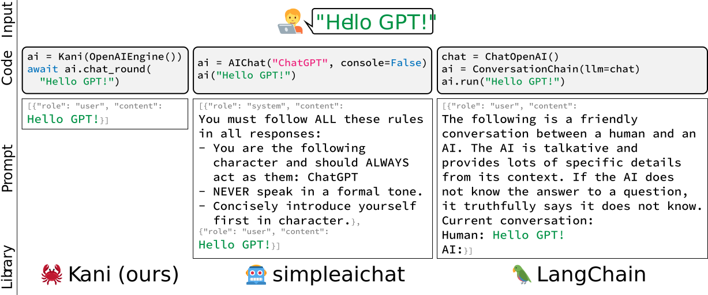

<p align="center">
  
</p>

<p align="center">
  <a href="https://github.com/zhudotexe/kani/actions/workflows/pytest.yml">
    
  </a>
  <a href="https://kani.readthedocs.io/en/latest/?badge=latest">
    
  </a>
  <a href="https://pypi.org/project/kani/">
    
  </a>
  <a href="https://colab.research.google.com/github/zhudotexe/kani/blob/main/examples/colab_quickstart.ipynb">
    
  </a>
</p>

# kani (カニ)

kani (カニ) is a lightweight and highly hackable framework for chat-based language models with tool usage/function
calling.

Compared to other LM frameworks, kani is less opinionated and offers more fine-grained customizability
over the parts of the control flow that matter, making it the perfect choice for NLP researchers, hobbyists, and
developers alike.

kani comes with support for OpenAI models and LLaMA v2 out of the box, with a model-agnostic framework to add support
for many more.

[Read the docs on ReadTheDocs!](http://kani.readthedocs.io/)

## Features

- **Lightweight and high-level** - kani implements common boilerplate to interface with language models without forcing
  you to use opinionated prompt frameworks or complex library-specific tooling.
- **Model agnostic** - kani provides a simple interface to implement: token counting and completion generation.
  Implement these two, and kani can run with any language model.
- **Automatic chat memory management** - Allow chat sessions to flow without worrying about managing the number of
  tokens in the history - kani takes care of it.
- **Function calling with model feedback and retry** - Give models access to functions in just one line of code.
  kani elegantly provides feedback about hallucinated parameters and errors and allows the model to retry calls.
- **You control the prompts** - There are no hidden prompt hacks. We will never decide for you how to format your own
  data, unlike other popular language model libraries.
- **Fast to iterate and intuitive to learn** - With kani, you only write Python - we handle the rest.
- **Asynchronous design from the start** - kani can scale to run multiple chat sessions in parallel easily, without
  having to manage multiple processes or programs.

## Quickstart

kani requires Python 3.10 or above.

First, install the library. In this quickstart, we'll use the OpenAI engine, though kani
is [model-agnostic](https://kani.readthedocs.io/en/latest/engines.html).

```shell
$ pip install "kani[openai]"
```

Then, let's use kani to create a simple chatbot using ChatGPT as a backend.

```python
# import the library
from kani import Kani, chat_in_terminal
from kani.engines.openai import OpenAIEngine

# Replace this with your OpenAI API key: https://platform.openai.com/account/api-keys
api_key = "sk-..."

# kani uses an Engine to interact with the language model. You can specify other model 
# parameters here, like temperature=0.7.
engine = OpenAIEngine(api_key, model="gpt-3.5-turbo")

# The kani manages the chat state, prompting, and function calling. Here, we only give 
# it the engine to call ChatGPT, but you can specify other parameters like 
# system_prompt="You are..." here.
ai = Kani(engine)

# kani comes with a utility to interact with a kani through your terminal! Check out 
# the docs for how to use kani programmatically.
chat_in_terminal(ai)
```

kani makes the time to set up a working chat model short, while offering the programmer deep customizability over
every prompt, function call, and even the underlying language model.

## Function Calling

Function calling gives language models the ability to choose when to call a function you provide based off its
documentation.

With kani, you can write functions in Python and expose them to the model with just one line of code: the `@ai_function`
decorator.

```python
# import the library
from typing import Annotated
from kani import AIParam, Kani, ai_function, chat_in_terminal
from kani.engines.openai import OpenAIEngine

# set up the engine as above
api_key = "sk-..."
engine = OpenAIEngine(api_key, model="gpt-3.5-turbo")


# subclass Kani to add AI functions
class MyKani(Kani):
    # Adding the annotation to a method exposes it to the AI
    @ai_function()
    def get_weather(
        self,
        # and you can provide extra documentation about specific parameters
        location: Annotated[str, AIParam(desc="The city and state, e.g. San Francisco, CA")],
    ):
        """Get the current weather in a given location."""
        # In this example, we mock the return, but you could call a real weather API
        return f"Weather in {location}: Sunny, 72 degrees fahrenheit."


ai = MyKani(engine)
chat_in_terminal(ai)
```

kani guarantees that function calls are valid by the time they reach your methods while allowing you to focus on
writing code. For more information, check
out [the function calling docs](https://kani.readthedocs.io/en/latest/function_calling.html).

## Why kani?

Existing frameworks for language models like langchain and simpleaichat are opinionated and/or heavyweight - they edit
developers' prompts under the hood, are challenging to learn, and are difficult to customize without adding a lot of
high-maintenance bloat to your codebase.

<p align="center">
  
</p>

We built kani to be more flexible, simple, and robust. kani is appropriate for everyone from academic researchers
to industry professionals to hobbyists to use without worrying about under-the-hood hacks.

## Docs

To learn more about how
to [customize kani with your own prompt wrappers](https://kani.readthedocs.io/en/latest/customization.html),
[function calling](https://kani.readthedocs.io/en/latest/function_calling.html), and
more, [read the docs!](http://kani.readthedocs.io/)

Or take a look at the hands-on examples [in this repo](https://github.com/zhudotexe/kani/tree/main/examples).

## Demo

Want to see kani in action? Using 4-bit quantization to shrink the model, we run LLaMA v2 as part of our test suite
right on GitHub Actions:

https://github.com/zhudotexe/kani/actions/workflows/pytest.yml?query=branch%3Amain+is%3Asuccess

Simply click on the latest build to see LLaMA's output!

<!--
For developers:

## Build and Publish

`fastlmi` uses Hatchling to build.

Make sure to bump the version in pyproject.toml before publishing.

```shell
rm -r dist/
python -m build
python -m twine upload dist/*
```
-->
