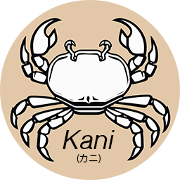
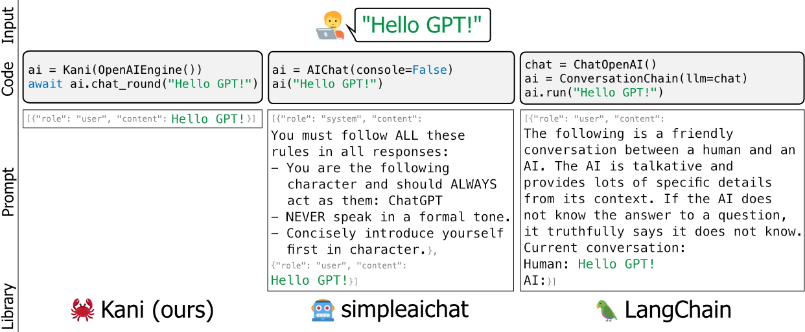

<p align="center">
  
</p>

<p align="center">
  <a href="https://github.com/zhudotexe/kani/actions/workflows/pytest.yml">
    
  </a>
  <a href="https://kani.readthedocs.io/en/latest/?badge=latest">
    
  </a>
  <a href="https://pypi.org/project/kani/">
    
  </a>
  <a href="https://colab.research.google.com/github/zhudotexe/kani/blob/main/examples/colab_examples.ipynb">
    
  </a>
  <a href="https://discord.gg/eTepTNDxYT">
    
  </a>
  <br/>
  <a href="examples/4_engines_zoo.py">
    
  </a>
  <a href="examples/5_advanced_retrieval.py">
    
  </a>
</p>

# kani (カニ)

kani (カニ) is a lightweight and highly hackable framework for chat-based language models with tool usage/function
calling.

Compared to other LM frameworks, kani is less opinionated and offers more fine-grained customizability
over the parts of the control flow that matter, making it the perfect choice for NLP researchers, hobbyists, and
developers alike.

kani comes with support for the following models out of the box, with a model-agnostic framework to add support for many
more:

**Hosted Models**

- OpenAI Models
- Anthropic Models

**Open Source Models**

kani supports _every_ chat model available on Hugging Face through `transformers` or `llama.cpp`!

<!--
In particular, we have reference implementations for the following base models, and their fine-tunes:

- [LLaMA 3](https://huggingface.co/collections/meta-llama/meta-llama-3-66214712577ca38149ebb2b6) (all sizes)
- [Mistral-7B](https://huggingface.co/mistralai/Mistral-7B-Instruct-v0.2),
  [Mixtral-8x7B](https://huggingface.co/mistralai/Mixtral-8x7B-Instruct-v0.1),
  and [Mixtral-8x22B](https://huggingface.co/mistralai/Mixtral-8x22B-Instruct-v0.1)
- [Command R](https://huggingface.co/CohereForAI/c4ai-command-r-v01)
  and [Command R+](https://huggingface.co/CohereForAI/c4ai-command-r-plus)
- [Gemma](https://huggingface.co/collections/google/gemma-release-65d5efbccdbb8c4202ec078b) (all sizes)
- [LLaMA 2](https://huggingface.co/meta-llama) (all sizes)
- [Vicuna v1.3](https://huggingface.co/lmsys/vicuna-7b-v1.3)
-->

Check out the [Model Zoo](examples/4_engines_zoo.py) for some examples of loading popular models in Kani!

**Interested in contributing? Check out our
[guide](https://kani.readthedocs.io/en/latest/community/contributing.html).**

[Read the docs on ReadTheDocs!](http://kani.readthedocs.io/)

[Read our paper on arXiv!](https://arxiv.org/abs/2309.05542)

## Features

- **Lightweight and high-level** - kani implements common boilerplate to interface with language models without forcing
  you to use opinionated prompt frameworks or complex library-specific tooling.
- **Model agnostic** - kani provides a simple interface to implement: token counting and completion generation.
  kani lets developers switch which language model runs on the backend without major code refactors.
- **Automatic chat memory management** - Allow chat sessions to flow without worrying about managing the number of
  tokens in the history - kani takes care of it.
- **Function calling with model feedback and retry** - Give models access to functions in just one line of code.
  kani elegantly provides feedback about hallucinated parameters and errors and allows the model to retry calls.
- **You control the prompts** - There are no hidden prompt hacks. We will never decide for you how to format your own
  data, unlike other popular language model libraries.
- **Fast to iterate and intuitive to learn** - With kani, you only write Python - we handle the rest.
- **Asynchronous design from the start** - kani can scale to run multiple chat sessions in parallel easily, without
  having to manage multiple processes or programs.

## Installation

kani requires Python 3.10 or above. To install model-specific dependencies, kani uses various extras (brackets after
the library name in `pip install`). To determine which extra(s) to install, see
the [model table](https://kani.readthedocs.io/en/latest/engines.html), or use the `[all]` extra to install everything.

```shell
# for OpenAI models
$ pip install "kani[openai]"
# for Hugging Face models
$ pip install "kani[huggingface]" torch
# or install everything:
$ pip install "kani[all]"
```

For the most up-to-date changes and new models, you can also install the development version from Git's `main` branch:

```shell
$ pip install "kani[all] @ git+https://github.com/zhudotexe/kani.git@main"
```

## Quickstart

<a href="https://colab.research.google.com/github/zhudotexe/kani/blob/main/examples/colab_examples.ipynb">
  
</a>

kani requires Python 3.10 or above.

First, install the library. In this quickstart, we'll use the OpenAI engine, though kani
is [model-agnostic](https://kani.readthedocs.io/en/latest/engines.html).

```shell
$ pip install "kani[openai]"
```

Then, let's use kani to create a simple chatbot using ChatGPT as a backend.

```python
# import the library
import asyncio
from kani import Kani, chat_in_terminal
from kani.engines.openai import OpenAIEngine

# Replace this with your OpenAI API key: https://platform.openai.com/account/api-keys
api_key = "sk-..."

# kani uses an Engine to interact with the language model. You can specify other model 
# parameters here, like temperature=0.7.
engine = OpenAIEngine(api_key, model="gpt-4o-mini")

# The kani manages the chat state, prompting, and function calling. Here, we only give 
# it the engine to call ChatGPT, but you can specify other parameters like 
# system_prompt="You are..." here.
ai = Kani(engine)

# kani comes with a utility to interact with a kani through your terminal...
chat_in_terminal(ai)


# or you can use kani programmatically in an async function!
async def main():
    resp = await ai.chat_round("What is the airspeed velocity of an unladen swallow?")
    print(resp.text)


asyncio.run(main())
```

kani makes the time to set up a working chat model short, while offering the programmer deep customizability over
every prompt, function call, and even the underlying language model.

## Function Calling

Function calling gives language models the ability to choose when to call a function you provide based off its
documentation.

With kani, you can write functions in Python and expose them to the model with just one line of code: the `@ai_function`
decorator.

```python
# import the library
import asyncio
from typing import Annotated
from kani import AIParam, Kani, ai_function, chat_in_terminal, ChatRole
from kani.engines.openai import OpenAIEngine

# set up the engine as above
api_key = "sk-..."
engine = OpenAIEngine(api_key, model="gpt-4o-mini")


# subclass Kani to add AI functions
class MyKani(Kani):
    # Adding the annotation to a method exposes it to the AI
    @ai_function()
    def get_weather(
        self,
        # and you can provide extra documentation about specific parameters
        location: Annotated[str, AIParam(desc="The city and state, e.g. San Francisco, CA")],
    ):
        """Get the current weather in a given location."""
        # In this example, we mock the return, but you could call a real weather API
        return f"Weather in {location}: Sunny, 72 degrees fahrenheit."


ai = MyKani(engine)

# the terminal utility allows you to test function calls...
chat_in_terminal(ai)


# and you can track multiple rounds programmatically.
async def main():
    async for msg in ai.full_round("What's the weather in Tokyo?"):
        print(msg.role, msg.text)


asyncio.run(main())
```

kani guarantees that function calls are valid by the time they reach your methods while allowing you to focus on
writing code. For more information, check
out [the function calling docs](https://kani.readthedocs.io/en/latest/function_calling.html).

## Streaming

kani supports streaming responses from the underlying language model token-by-token, even in the presence of function
calls. Streaming is designed to be a drop-in superset of the ``chat_round`` and ``full_round`` methods, allowing you to
gradually refactor your code without ever leaving it in a broken state.

```python
async def stream_chat():
    stream = ai.chat_round_stream("What does kani mean?")
    async for token in stream:
        print(token, end="")
    print()
    msg = await stream.message()  # or `await stream`


async def stream_with_function_calling():
    async for stream in ai.full_round_stream("What's the weather in Tokyo?"):
        async for token in stream:
            print(token, end="")
        print()
        msg = await stream.message()
```

## Why kani?

Existing frameworks for language models like LangChain and simpleaichat are opinionated and/or heavyweight - they edit
developers' prompts under the hood, are challenging to learn, and are difficult to customize without adding a lot of
high-maintenance bloat to your codebase.

<p align="center">
  
</p>

We built kani as a more flexible, simple, and robust alternative. A good analogy between frameworks would be to say that
kani is to LangChain as Flask (or FastAPI) is to Django.

kani is appropriate for everyone from academic researchers to industry professionals to hobbyists to use without
worrying about under-the-hood hacks.

## Docs

To learn more about how
to [customize kani with your own prompt wrappers](https://kani.readthedocs.io/en/latest/customization.html),
[function calling](https://kani.readthedocs.io/en/latest/function_calling.html), and
more, [read the docs!](http://kani.readthedocs.io/)

Or take a look at the hands-on examples [in this repo](https://github.com/zhudotexe/kani/tree/main/examples).

## Demo

Want to see kani in action? Using 4-bit quantization to shrink the model, we run LLaMA v2 as part of our test suite
right on GitHub Actions:

https://github.com/zhudotexe/kani/actions/workflows/pytest.yml?query=branch%3Amain+is%3Asuccess

Simply click on the latest build to see LLaMA's output!

## Who we are


The core development team is made of three PhD students in the Department of Computer and Information Science at the
University of Pennsylvania. We're all members of
[Prof. Chris Callison-Burch's](https://www.cis.upenn.edu/~ccb/) lab, working towards advancing the future of NLP.

- [**Andrew Zhu**](https://zhu.codes/) started in Fall 2022. His research interests include natural language processing,
  programming languages, distributed systems, and more. He's also a full-stack software engineer, proficient in all
  manner of backend, devops, database, and frontend engineering. Andrew strives to make idiomatic, clean, performant,
  and low-maintenance code — philosophies that are often rare in academia. His research is supported by the NSF Graduate
  Research Fellowship.
- [**Liam Dugan**](https://liamdugan.com/) started in Fall 2021. His research focuses primarily on large language models
  and how humans interact with them. In particular, he is interested in human detection of generated text and whether we
  can apply those insights to automatic detection systems. He is also interested in the practical application of large
  language models to education.
- [**Alyssa Hwang**](https://alyssahwang.com/) started in Fall 2020 and is advised by Chris Callison-Burch and Andrew
  Head. Her research focuses on AI assistants that effectively communicate complex information, like voice assistants
  guiding users through instructions or audiobooks allowing users to seamlessly navigate through spoken text. Beyond
  research, Alyssa chairs the Penn CIS Doctoral Association, founded the CIS PhD Mentorship Program, and was supported
  by the NSF Graduate Research Fellowship Program.

We use kani actively in our research, and aim to keep it up-to-date with modern NLP practices.

## Citation

If you use Kani, please cite us as:

```
@inproceedings{zhu-etal-2023-kani,
    title = "Kani: A Lightweight and Highly Hackable Framework for Building Language Model Applications",
    author = "Zhu, Andrew  and
      Dugan, Liam  and
      Hwang, Alyssa  and
      Callison-Burch, Chris",
    editor = "Tan, Liling  and
      Milajevs, Dmitrijs  and
      Chauhan, Geeticka  and
      Gwinnup, Jeremy  and
      Rippeth, Elijah",
    booktitle = "Proceedings of the 3rd Workshop for Natural Language Processing Open Source Software (NLP-OSS 2023)",
    month = dec,
    year = "2023",
    address = "Singapore",
    publisher = "Association for Computational Linguistics",
    url = "https://aclanthology.org/2023.nlposs-1.8",
    doi = "10.18653/v1/2023.nlposs-1.8",
    pages = "65--77",
}
```

### Acknowledgements

We would like to thank the members of the lab of Chris Callison-Burch for their testing and detailed feedback on the
contents of both our paper and the Kani repository. In addition, we’d like to thank Henry Zhu (no relation to the first
author) for his early and enthusiastic support of the project.

This research is based upon work supported in part by the Air Force Research Laboratory (contract FA8750-23-C-0507), the
IARPA HIATUS Program (contract 2022-22072200005), and the NSF (Award 1928631). Approved for Public Release, Distribution
Unlimited. The views and conclusions contained herein are those of the authors and should not be interpreted as
necessarily representing the official policies, either expressed or implied, of IARPA, NSF, or the U.S. Government.
