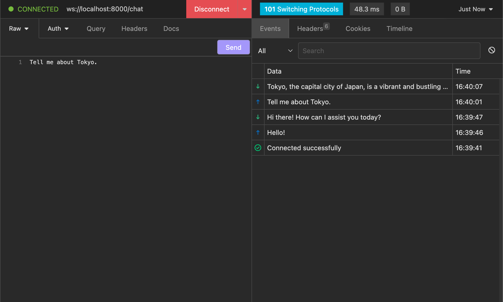

Advanced Usage
==============
In this section, we'll look at some of the advanced use cases you can use kani for.
Each of these use cases has an example in `the GitHub repo <https://github.com/zhudotexe/kani/tree/main/examples>`_.

Sub-kanis
---------
When used in conjunction with :doc:`function_calling`, kani can choose when to spawn "sub-kani" - self-contained
"agents" capable of performing their own tasks, then reporting to the parent with their results.

For example, you might have the parent kani use a cheaper, faster model - but with the tradeoff that that model has a
smaller context length. If you need it to perform a task that requires more context, you can spawn a sub-kani using
a more expensive, slower model with a larger context.

.. caution::
    Be careful when creating a new kani instance with an existing kani's chat history!
    If you pass an old kani's chat history to a new kani without copying it, the same list will be mutated.

    Use ``newkani = Kani(..., chat_history=oldkani.chat_history.copy())`` to pass a copy.

    Index slicing (as shown in the example below) also creates a copy.

.. code-block:: python

    class KaniWithAISummarization(Kani):
        @ai_function()
        async def summarize_conversation(self):
            """Get the summary of the conversation so far."""
            # in this AI Function, we can spawn a sub-kani with a model that can handle
            # longer contexts, since the conversation may be longer than the fast model's
            # context window
            long_context_engine = OpenAIEngine(api_key, model="gpt-4-32k")
            # copy the parent's chat history to the child, except the last user message
            # and the function call ([:-2])
            sub_kani = Kani(long_context_engine, chat_history=self.chat_history[:-2])
            # then we ask it to summarize the whole thing, and return the result to the parent
            return await sub_kani.chat_round_str("Please summarize the conversation so far.")

Of course, the sub-kani you spawn doesn't have to be a vanilla kani - you could imagine having multiple different
kani types with different sets of functions or engines, each capable of performing their own specialized tasks.

.. code-block:: pycon

    >>> chat_in_terminal(KaniWithAISummarization(engine))
    USER: Tell me about trains.
    AI: Trains are a mode of long-distance transport...

    [Multiple turns of conversation.]

    USER: Summarize the conversation.
    AI: Thinking (summarize_conversation)...
    AI: Our conversation began with a general overview about trains, their history, types,
    benefits, and how railway systems work around the world. We then moved onto discussing
    the best high-speed rail lines around the world, with a specific focus on the Japanese
    train system.

    Your interest in trainspotting in Tokyo led to the sharing of some popular locations
    in the city and a discussion about unique, non-standard train lines in Japan, including
    lines that go through a tunnel of trees.

    After exploring the topic of trains in Japan, we shifted to talk about lesser-known
    attractions in Japan, which led to detailing a potential summer itinerary for a trip
    starting in Tokyo and heading south.

Retrieval
---------
Retrieval is the idea that models can be augmented with an external factual database that they can *retrieve*
information from, allowing them to access more relevant and up-to-date information without having to train.

In this example, we demonstrate how kani's function calling can be used to retrieve information from a data source
like Wikipedia.

.. code-block:: python

    # let's define a client using kani's BaseClient:
    class WikipediaClient(BaseClient):
        SERVICE_BASE = "https://en.wikipedia.org/w/api.php"

    class WikipediaRetrievalKani(Kani):
        def __init__(self, *args, **kwargs):
            super().__init__(*args, **kwargs)
            self.wikipedia_client = WikipediaClient()

        @ai_function()
        async def wikipedia(
            self,
            title: Annotated[
                str,
                AIParam(desc='The article title on Wikipedia, e.g. "Train_station".')
            ],
        ):
            """Get additional information about a topic from Wikipedia."""
            resp = await self.wikipedia_client.get(
                "/",
                params={
                    "action": "query",
                    "format": "json",
                    "prop": "extracts",
                    "titles": title,
                    "explaintext": 1,
                    "formatversion": 2,
                },
            )
            page = resp["query"]["pages"][0]
            if extract := page.get("extract"):
                return extract
            return f"The page {title!r} does not exist on Wikipedia."

        @ai_function()
        async def search(self, query: str):
            """Find titles of Wikipedia articles similar to the given query."""
            resp = await self.wikipedia_client.get(
                "/",
                params={"action": "opensearch", "format": "json", "search": query}
            )
            return json.dumps(resp[1])

.. code-block:: pycon

    >>> chat_in_terminal(WikipediaRetrievalKani(engine))
    USER: Tell me about the Yamanote line in Tokyo.
    AI: Thinking (search)...
    AI: Thinking (wikipedia)...
    AI: The Yamanote Line is a loop service in Tokyo, Japan...

.. caution::

    Wikipedia articles might be longer than can fit in the model's context window. Try combining this with the sub-kani
    summarization example above to build a powerful retrieval agent!

    You may also use ``@ai_function(auto_truncate=...)`` if truncating the response is acceptable.

Hosting kani Online
-------------------
What if you want to host a web service that allows its users to chat with kani? In this example, we show how you can
allow users to connect to a kani hosted on a webserver using a WebSocket connection. Since kani supports asyncio and
is built with parallelization in mind, you can have as many people as you want connect at once!

We'll use `FastAPI <https://fastapi.tiangolo.com/>`_ to run this webserver. To connect to it, you can use any client
that supports WebSockets, like `Insomnia <https://insomnia.rest/>`_.

.. code-block:: python

    engine = OpenAIEngine(api_key, model="gpt-3.5-turbo")
    app = FastAPI()

    @app.websocket("/chat")
    async def kani_chat(websocket: WebSocket):
        # accept the websocket and initialize a kani for the connection
        await websocket.accept()
        ai = Kani(engine)
        # take string messages and send string responses
        while True:
            try:
                data = await websocket.receive_text()
                resp = await ai.chat_round_str(data)
                await websocket.send_text(resp)
            # until the client disconnects
            except WebSocketDisconnect:
                return

    @app.on_event("shutdown")
    async def cleanup_kani():
        """When the application shuts down, cleanly close the kani engine."""
        await engine.close()

Now, you can run the service and connect to it (by default, ``uvicorn`` binds to ``127.0.0.1:8000``).

.. code-block:: pycon

    >>> uvicorn.run(app)

.. tip::

    In a real production environment, you might want to send JSON payloads over the WebSocket rather than raw strings.

Function "Loadouts": Polymorphism & Mixins
------------------------------------------
What if you have some common AI functions that you want to share with multiple kani? For example, what if you've
written a solid calculator suite you want to give to two different kani - one with web retrieval and one without.

Since kani are implemented in pure Python, you can accomplish this with polymorphism!

Base Class
^^^^^^^^^^
One method is to make one of the kani a base, then subclass it to extend its functionality:

.. code-block:: python

    class BaseKani(Kani):
        @ai_function()
        def calculate(self, expr: str):
            ...

    class ChildKani(BaseKani):
        @ai_function()
        def search(self, query: str):
            ...

In this example, the ``ChildKani`` has access to both ``search`` *and* ``calculate``.

.. _mixins:

Mixins
^^^^^^
But in some cases, you won't necessarily have a single base to extend, and you might want to share multiple different
modular "loadouts" of functions. ``@ai_function``\ s don't have to be defined in :class:`.Kani` classes, so in this
case, you can use a mixin!

.. code-block:: python

    # note: the mixin isn't a subclass of Kani!
    class CalculatorMixin:
        @ai_function()
        def add(self, left: float, right: float):
            return left + right

        @ai_function()
        def mul(self, left: float, right: float):
            return left * right

    # reuse it to give a loadout of functions to multiple kani!
    class MyKani(CalculatorMixin, Kani):
        @ai_function()
        def search(self, query: str):
            ...

    class SomeOtherKani(CalculatorMixin, Kani):
        @ai_function()
        def music(self, song: str):
            ...

In this example, both the kani (``MyKani`` and ``SomeOtherKani``) have access to ``add`` and ``mul`` in addition to
the functions defined in their class body.

Just as in normal Python, you can inherit from multiple mixins. You can use this to build kani with modular sets of
functionality!

.. _message-parts:

Message Parts
-------------
In some advanced use cases, :attr:`.ChatMessage.content` may be a tuple of :class:`.MessagePart` or ``str`` rather than
a string. ChatMessage exposes :attr:`.ChatMessage.text` (always a string or None) and :attr:`.ChatMessage.parts` (always
a list of message parts), which we recommend using instead of :attr:`.ChatMessage.content`. These properties are
dynamically generated based on the underlying content, and it is safe to mix messages with different content types in a
single Kani.

Generally, message part classes are *defined* by the engine, and *consumed* by the developer. Message parts can be used
in any role's message - for example, you might use a message part in an assistant message to separate out a chain of
thought from a user reply, or in a user message to supply an image to a multimodal model.

Let's say you wanted your model to perform a chain-of-thought before replying to the user, but didn't want that
chain of thought to be visible in its output. In the example below, we'll define a hidden *ThoughtPart* that contains
this data, and have our engine use this when building the prompt. This may be a little bit contrived, but hopefully
it demonstrates how to use the MessagePart interface.

Defining a MessagePart
^^^^^^^^^^^^^^^^^^^^^^
To define a :class:`.MessagePart`, you should create a new class that inherits from :class:`.MessagePart`.

Under the hood, a MessagePart is a Pydantic model, so to add attributes to your part, you can define them as
type-annotated class variables. For example, to add a ``data`` attribute with a string type, you can define
``data: str``.

Next, you'll want to define the ``__str__()`` method, which is how kani defines the behaviour when your message part
is cast to a string. This happens in a couple places:

1. The message part is displayed to the user through a string-casting method (e.g. :meth:`.Kani.full_round_str`)
2. The user is using the :func:`.chat_in_terminal` development utility
3. The message was provided to an engine that does not support the class (e.g. an image part in a text-only model).

The default behaviour is to transform the part to a Python-esque representation of its data (e.g.
``<ThoughtPart data="...">``) and log a warning. You can override this method to specify the canonical string
representation of your message part.

.. code-block:: python

    from kani import MessagePart

    class ThoughtPart(MessagePart):
        # hold some string data that is the chain-of-thought
        data: str

        # when stringified, this part should be hidden from the user/any engine that does not explicitly support it
        def __str__(self):
            return ""

When you define a MessagePart, kani will automatically register serialization and deserialization schemes for your
class, so that all MessageParts are compatible with :meth:`.Kani.save` and :meth:`.Kani.load`.

.. warning::
    If you change the attributes or location of the class definition, old data may fail to be loaded into a new class.

Using MessageParts in Engines
^^^^^^^^^^^^^^^^^^^^^^^^^^^^^
Once we define a message part, we need to tell the engine how to use it. Since message parts are designed to provide
engine-specific metadata while maintaining cross-engine compatibility, engines should check for the classes they know
and cast unknown classes to a string. This lets parts control how they will be serialized in engines that don't natively
support them.

A common, but not necessary, pattern is to write an engine that *wraps* other engines. This wrapper engine acts as a
translation layer for specific message parts, eventually compiling a single string (or list of strings) for a base
engine (e.g. LlamaEngine) to consume.

Here's the implementation for our chain-of-thought example. Note how we translate the parts by building a new message
with a string content composed of parts in ``translate_message``, then use that method in our implementations of
``message_len`` and ``predict``.

.. code-block:: python

    from kani import AIFunction, ChatMessage, MessagePart
    from kani.engines.base import BaseEngine, Completion

    class ChainOfThoughtEngine(BaseEngine):
        def __init__(self, engine: BaseEngine):
            self.engine = engine
            self.max_context_size = engine.max_context_size

        @staticmethod
        def translate_message(message: ChatMessage) -> ChatMessage:
            """Translate a input message into a simple string-only message to pass to the underlying engine."""
            content = ""
            # iterate over parts: if it's a thought, place its data in the content; otherwise prefix it with "Answer: "
            for part in message.parts:
                if isinstance(part, ThoughtPart):
                    content += f"{part.data}\n"
                else:
                    content += f"Answer: {str(part)}"
            # return the translated message
            return message.copy_with(content=content.strip())

        # === BaseEngine interface ===
        def message_len(self, message: ChatMessage) -> int:
            return self.engine.message_len(self.translate_message(message))

        async def predict(
            self, messages: list[ChatMessage], functions: list[AIFunction] | None = None, **hyperparams
        ) -> Completion:
            # translate the messages
            translated_messages = [self.translate_message(m) for m in messages]

            # generate a completion using the underlying engine given those messages
            result = await self.engine.predict(translated_messages, functions, **hyperparams)

            # parse the string-completion back into parts - with some checks to make sure the model actually output the
            # right format
            text = result.message.text
            if "Answer:" in text:
                thought, answer = text.split("Answer:", 1)
                message_with_parts = result.message.copy_with(parts=[ThoughtPart(data=thought.strip()), answer.strip()])
            else:
                message_with_parts = result.message

            # we'll print the result so you can see the parts, though a real engine wouldn't want to
            print("Model response with parts:", message_with_parts.parts)
            # and return the modified answer
            return Completion(
                message=message_with_parts,
                prompt_tokens=result.prompt_tokens,
                completion_tokens=result.completion_tokens,
            )

        # additional overrides that pass-through to underlying engine
        def function_token_reserve(self, functions):
            return self.engine.function_token_reserve(functions)

        async def close(self):
            return await self.engine.close()

Now, we can use this engine by passing an underlying engine to it, prompt our model to follow our chain-of-thought
format, and see how it works!

.. code-block:: python

    cot_engine = ChainOfThoughtEngine(OpenAIEngine())
    ai = Kani(
        cot_engine,
        system_prompt=(
            "When answering the user, think step by step. Output your thoughts first, "
            'then output the final answer on its own line, in the format "Answer: {answer}".'
        ),
    )
    chat_in_terminal(ai)

    # USER: Roger has 5 tennis balls. He buys 2 more cans of tennis balls. Each can has 3 tennis balls.
    # How many tennis balls does he have now?
    #
    # Model response with parts:
    #   [ThoughtPart(data='Roger already has 5 tennis balls. He buys 2 more cans of tennis balls, and each can has 3 tennis balls. \n\nTo find out how many tennis balls he has now, we need to multiply the number of cans with the number of tennis balls in each can. Since he bought 2 cans, we multiply 2 by 3:\n\n2 cans * 3 tennis balls per can = 6 tennis balls from the cans\n\nNext, we add the number of tennis balls he already had:\n\n5 tennis balls + 6 tennis balls = 11 tennis balls'),
    #   'Roger now has 11 tennis balls.']
    #
    # AI: Roger now has 11 tennis balls.

See how the engine splits up the model's response into two parts: the thought and the displayed answer. In the
:func:`.chat_in_terminal` development utility, we only display the displayed answer, but in a larger application you'd
get the full :class:`.ChatMessage`, and you could iterate over the parts to handle displaying the thought with your own
application logic.

If you switch to a different base engine and inject the chat history, the base engine won't see the thoughts, since
the default stringification behaviour is to return the empty string. This means that you can build complex engine
behaviour that won't interfere with other engines.

Now you can use any message part you can think of - and you can create user messages with parts too.
