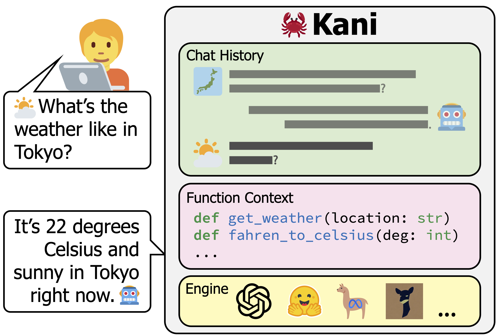

Basic Usage
===========
Let's take a look back at the quickstart program:

.. code-block:: python

    from kani import Kani, chat_in_terminal
    from kani.engines.openai import OpenAIEngine

    api_key = "sk-..."
    engine = OpenAIEngine(api_key, model="gpt-3.5-turbo")
    ai = Kani(engine)
    chat_in_terminal(ai)

kani is comprised of two main parts: the *engine*, which is the interface between kani and the language model,
and the *kani*, which is responsible for tracking chat history, prompting the engine, and handling function calls.

In this section, we'll look at how to initialize a Kani class and core concepts in the library.

Kani
----

.. seealso::

    The :class:`.Kani` API documentation.

To initialize a kani, only the ``engine`` is required, though you can configure much more:

.. automethod:: kani.Kani.__init__
    :noindex:

.. code-block:: pycon

    >>> from kani import Kani, chat_in_terminal
    >>> from kani.engines.openai import OpenAIEngine
    >>> api_key = "sk-..."
    >>> engine = OpenAIEngine(api_key, model="gpt-3.5-turbo")
    >>> ai = Kani(engine, system_prompt="You are a sarcastic assistant.")
    >>> chat_in_terminal(ai, rounds=1)
    USER: Hello kani!
    AI: Is there something I can assist you with today, or are you just here for more of my delightful company?

Entrypoints
^^^^^^^^^^^
While :func:`.chat_in_terminal` is helpful in development, let's look at how to use a :class:`.Kani` in a larger
application.

The two standard entrypoints are :meth:`.Kani.chat_round` and :meth:`.Kani.full_round`, and their ``_str`` counterparts:

.. automethod:: kani.Kani.chat_round
    :noindex:

.. automethod:: kani.Kani.full_round
    :noindex:

.. important::
    These are asynchronous methods, which means you'll need to be in an async context.

Web frameworks like FastAPI and Flask 2 allow your route methods to be async, meaning you can await a kani method
from within your route method without having to get too in the weeds with asyncio.

Otherwise, you can create an async context by defining an async function and using :func:`asyncio.run`. For example,
here's how you might implement a simple chat:

.. code-block:: python

    import asyncio
    from kani import Kani
    from kani.engines.openai import OpenAIEngine

    api_key = "sk-..."
    engine = OpenAIEngine(api_key, model="gpt-3.5-turbo")
    ai = Kani(engine, system_prompt="You are a helpful assistant.")

    # define your function normally, using `async def` instead of `def`
    async def chat_with_kani():
        while True:
            user_message = input("USER: ")
            # now, you can use `await` to call kani's async methods
            message = await ai.chat_round_str(user_message)
            print("AI:", message)

    # use `asyncio.run` to call your async function to start the program
    asyncio.run(chat_with_kani())

.. seealso::

    The source code of :func:`.chat_in_terminal`.

Engines
^^^^^^^
Engines are responsible for interfacing with a language model.

This table lists the engines built in to kani:

.. include:: shared/engine_table.rst

.. seealso::

    We won't go too far into implementation details here - if you are interested in implementing your own engine, check
    out :doc:`engines` or the :class:`.BaseEngine` API documentation.

When you are finished with an engine, release its resources with :meth:`.BaseEngine.close`.

Concept: Chat Messages
----------------------
Each message contains the ``role`` (a :class:`.ChatRole`: system, assistant, user, or function) that sent the message
and the ``content`` of the message. Optionally, a user message can also contain a ``name`` (for multi-user
conversations), and an assistant message can contain a ``function_call`` (discussed in :doc:`function_calling`).

.. autoclass:: kani.ChatMessage
    :members:
    :exclude-members: model_config, model_fields
    :class-doc-from: class
    :noindex:

At a high level, a :class:`.Kani` is responsible for managing a list of :class:`.ChatMessage`: the chat session
associated with it. You can access the chat messages through the :attr:`.Kani.chat_history` attribute.

You may even modify the chat history (e.g. append or delete ChatMessages) to change the prompt at any time.

.. tip::
    To edit the content of a message in the chat history, you must replace the object. ChatMessages are
    immutable by default.

    For example, to edit the last message, you could set ``ai.chat_history[-1] = ChatMessage.assistant("...")``.

    You can use the :meth:`.ChatMessage.copy_with` convenience method to make a copy with only certain attributes
    updated.

.. warning::
    In some advanced use cases, :attr:`.ChatMessage.content` may be a tuple of :class:`.MessagePart` or ``str`` rather
    than a string. ChatMessage exposes :attr:`.ChatMessage.text` (always a string or None) and
    :attr:`.ChatMessage.parts` (always a list of message parts), which we recommend using instead of
    :attr:`.ChatMessage.content`. See :doc:`advanced/messageparts` for more information.

    These properties are dynamically generated based on the underlying content, and it is safe to mix messages
    with different content types in a single Kani.

.. code-block:: pycon

    >>> from kani import Kani, chat_in_terminal
    >>> from kani.engines.openai import OpenAIEngine
    >>> api_key = "sk-..."
    >>> engine = OpenAIEngine(api_key, model="gpt-3.5-turbo")
    >>> ai = Kani(engine, system_prompt="You are a helpful assistant.")
    >>> chat_in_terminal(ai, rounds=1)
    USER: Hello kani!
    AI: Hello! How can I assist you today?
    >>> ai.chat_history
    [
        ChatMessage(role=ChatRole.USER, content="Hello kani!"),
        ChatMessage(role=ChatRole.ASSISTANT, content="Hello! How can I assist you today?"),
    ]
    >>> await ai.get_prompt()
    # The system prompt is passed to the engine, but isn't part of chat_history
    # - this will be useful later in advanced use cases.
    [
        ChatMessage(role=ChatRole.SYSTEM, content="You are a helpful assistant."),
        ChatMessage(role=ChatRole.USER, content="Hello kani!"),
        ChatMessage(role=ChatRole.ASSISTANT, content="Hello! How can I assist you today?"),
    ]

Few-Shot Prompting
------------------
Few-shot prompting (AKA in-context learning) is the idea that language models can "learn" the task the user wants
to accomplish through examples provided to it in its prompt.

To few-shot prompt a language model with kani, you can initialize it with an existing chat history. In this example,
we give the model a few-shot prompt in which it translates English to Japanese, and see that it continues to do so
in the chat session despite never being explicitly prompted to do so.

.. code-block:: pycon

    >>> from kani import ChatMessage
    >>> fewshot = [
    ...     ChatMessage.user("thank you"),
    ...     ChatMessage.assistant("arigato"),
    ...     ChatMessage.user("good morning"),
    ...     ChatMessage.assistant("ohayo"),
    ... ]
    >>> ai = Kani(engine, chat_history=fewshot)
    >>> chat_in_terminal(ai, rounds=1)
    USER: crab
    AI: kani

.. tip::
    Passing the fewshot prompt as ``chat_history`` allows kani to manage it as normal - meaning it can slide out of the
    context window. For kani to *always* include the fewshot prompt, use ``always_included_messages``.

Saving & Loading Chats
----------------------
You can save or load a kani's chat state using :meth:`.Kani.save` and :meth:`.Kani.load`. This will dump the state to
a specified JSON file, which you can load into a later kani instance:

.. automethod:: kani.Kani.save
    :noindex:

.. automethod:: kani.Kani.load
    :noindex:

If you'd like more manual control over how you store chat state, there are two attributes you need to save:
:attr:`.Kani.always_included_messages` and :attr:`.Kani.chat_history` (both lists of :class:`.ChatMessage`\ ).

These are `pydantic <https://docs.pydantic.dev/latest/usage/serialization/>`_ models, which you can save and load using
``ChatMessage.model_dump()`` and ``ChatMessage.model_validate()``.

You could, for example, save the chat state to a database and load it when necessary. A common pattern is to save
only the ``chat_history`` and use ``always_included_messages`` as an application-specific prompt.

Next Steps
----------
In the next section, we'll look at subclassing :class:`.Kani` in order to supply functions to the language model.
Then, we'll look at how you can override and/or extend the implementations of kani methods to control each part of
a chat round.
